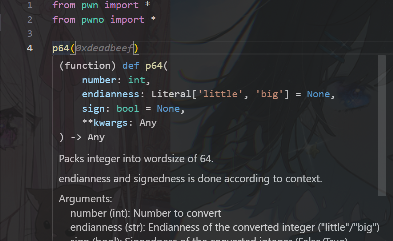

<div align="center">

# PwNo

_✨ Pwntools Extensions that Just Works! ✨_

<p>
<a href="./LICENSE">
    
</a>
</p>
<a href="https://pypi.python.org/pypi/PwNo">
    
</a>


<p>

</p>

</div>

快速拓展你的 [pwntools](https://github.com/Gallopsled/pwntools)，使其更加易用，针对 pwn 开发

## Features

- [x] 开箱即用
- [x] 完整的类型注解
- [x] 好用简单的小工具
- [ ] And more...

## TL;DR

### 一键缩写

```python
from pwno import *

p = process(['/path/to/your/elf'])

sl(b'cat /flag')
ia()  # 无需设置！
```

see [abbr](#abbr)

### 可选命令行参数

```python
# 只需使用同一份代码！
from pwno import *

sh = gen_sh()
dbg('b *$rebase(0x1145)')
sl(b'A'*0x20 + p64(elf.sym['backdoor']))
libc.address = uu64(recv(6)) - 0x114514
ia()
```

```sh
python exp.py  # 默认为 ./pwn
python exp.py my_challenge  # 生成 ./my_challenge
python exp.py -r my.challenge.pwn:11451 -l libc.so.6 # 远程调试，此时自动禁用 debug 模式
```

see [CommandArgs](#CommandArgs)

### 一键模板

```python
# 快速设置！
from pwno import *

io = IO_FILE_plus()
io._flags = 1
io.vtable = ...

send(bytes(io))


cat = HouseOfCat()
cat.rdi = b'/bin/sh'
cat.call_addr = libc.sym['system']
send(bytes(cat))
ia()
```

### And More ...

## Installation

<details>
<summary>使用 pip 安装</summary>

    pip install PwNo --upgrade

</details>

<details>
<summary>本地安装</summary>

    git clone https://github.com/MuelNova/PwNo
    cd PwNo
    pip install -e .

</details>

## Usage

只需在你的 exp.py 导入

```python
from pwno import *
```

## Docs

### context

#### abbr

PwNo 为脚本实现了缩写功能以加速你的脚本编写，而你不需要做任何操作

> 默认的导出：
>
> ​ >>> send = process.send
> ​ >>> sl = process.sendline
> ​ >>> sa = process.sendafter
> ​ >>> sla = process.sendlineafter
>
> ​ >>> recv = process.recv
> ​ >>> recvu = process.recvuntil
> ​ >>> recvn = process.recvn
> ​ >>> recvl = process.recvline
>
> ​ >>> ia = process.interactive

```python
from pwno import *

p = process(['/path/to/your/elf'])

sl(b'cat /flag')  # equals to p.sendline(b'cat /flag')
ia()  # equals to p.interactive()
```

这对变量名没有任何要求

```python
from pwno import *

I_Hate_PWN = remote('weird.challenge.pwn', 11451)

sl(b'cat /flag')  # equals to I_Hate_PWN.sendline(b'cat /flag')
ia()  # equals to I_Hate_PWN.interactive()
```

同时也支持循环操作，甚至修改变量名！在原来的 process 不可用的情况下，PwNo 会重新找到最新创建的 process/remote

```python
from pwno import *

p = process(['/path/to/your/elf'])
# I hate the name 'p'
p.close()
while True:
    sh = process(['/path/to/your/elf'])

    sl('I like sh!')  # equals to sh.sendline('I like sh!')
    sh.close()
```

不喜欢 PwNo 设置的缩写？Make your own!

使用 `abbr`，你可以轻松的设置你自己的缩写，或是设置全局的缩写

```python
from pwno import *

p = process(['/path/to/your/elf'])
sh = process(['/path/to/your/elf'])

new_sl = abbr(process.sendline)  # Global Abbreviation
new_sl(b'sh')  # equals to sh.sendline(b'sh')


my_sl = abbr(p.sendline)
my_sl(b'OH~~~')  # equals to p.sendline(b'OH~~~')
new_sl(b'sh')  # equals to sh.sendline(b'sh')

sh.close()
new_sl(b'p')  # equals to p.sendline(b'p')
```

**！注意！**

对于全局缩写，为了优化性能，脚本在命令使用一次后将会把此时最新的 `process` 与命令进行绑定，此后除非绑定 `process` 不可用，否则都会指向绑定 `process`。

```python
from pwno import *

sh = process(['/path/to/your/elf'])
sl(b'I send here, I bind here')  # `sl` will be bind to `sh`

p = process(['/path/to/your/elf'])
send(b'I send, I bind p')  # call `p.send`
sl(b'AM I still sh?')  # call `sh.sendline`
```

### typing

#### pack

PwNo 为常用的包装与解包函数添加了类型注解，现在你终于不需要对着标红的 `p64` \ `u32` 眉头紧皱了！



### helper

PwNo 提供了省时省力的小工具加快你的解题。

#### uu64 / uu32

泄露地址仍然使用 `u64(recv(6).ljust(8, b'\x00'))`？为什么不试试

```python
uu64(recv(6))
```

#### dbg

自动添加 `pause()` 与判断是否远程的 dbg 工具

在不指定前会使用最新的一个 `process` 实例

```python
from pwno import *

p = process('./pwn')
sh = gen_sh()  # or sh = process('./pwn')  or sh = remote('your.challenge.pwn', 11451)
dbg('b *$rebase(0x1145)', s=5)

dbg('set follow-fork-mode parent', sh=sh)
```

#### log

PwNo 使用更多的黑魔法让你的调试变得更快更好

```python
libc_base = u64(p.recv(6).ljust(8, b'\x00'))
success(f"libc_base: {hex(libc_base)}")

# 为什么不试试
libc.addr = uu64(recv(6))
success(libc.addr)

"
[+] libc.address: 0xdeadbeef(3735928559)
"

payload = asm(shellcraft.sh())
info(payload)

"""
[+] payload
    00000000  6a 68 48 b8  2f 62 69 6e  2f 2f 2f 73  50 48 89 e7  │jhH·│/bin│///s│PH··│
    00000010  68 72 69 01  01 81 34 24  01 01 01 01  31 f6 56 6a  │hri·│··4$│····│1·Vj│
    00000020  08 5e 48 01  e6 56 48 89  e6 31 d2 6a  3b 58 0f 05  │·^H·│·VH·│·1·j│;X··│
    00000030
"""
```

### IO_FILE / IO_FILE_plus

PwNo 使得你可以简便的设置 fake_IO

```python
from pwno import *

io = IO_FILE_plus()
io._flags = 1
io.vtable = ...
send(bytes(io))

io2 = IO_FILE()
io._IO_write_ptr = 0xdeadbeef
io._IO_write_base = p64(0xc0decafe)
send(bytes(io))
```

### House

PwNo 提供了简便设置各种漏洞利用结构体的方法

#### house_of_cat

```python
from pwno import *
    """
    FSOP 版本的 house_of_cat，在 2.35 下测试通过，返回一个 fake_IO payload
        rdi: 仅能设置 rdi 指针所指向的内容
        rdx: rdx 寄存器内容
        fake_io_addr: fake_IO 的地址
        call_addr: 调用的地址

        e.g.
            cat = house_of_cat()
            cat.fake_io_addr = heap
            cat.rdi = b"/bin/sh\x00"
            cat.rdx = p64(0xcafec0de)
            cat.call_addr = p64(backd00r)
            cat.vtable = p64(libc.sym['_IO_wfile_jumps'] + 0x30)

            send(bytes(cat))
    """
cat = HouseOfCat()
cat.rdi = b'/bin/sh'
cat.rdx = 0xcafec0de
cat.call_addr = lib.sym['setcontext'] + 61
cat.fake_io = heap

send(cat)
```

### CommandArgs

PwNo 提供了开箱即用的命令行参数方便使用，你无需任何设置，这并非强制的，它们都设置好了默认值。但 PwNo 推荐你结合 PwNo 提供的一些方法使得它更易用。

```sh
# python exp.py --help
usage: exp.py [-h] [--libc [LIBC]] [--debug DBG] [--no-debug] [--remote REMOTE] [--host HOST] [--port PORT] [--gdb]
              [--gdb-script GDB_SCRIPT] [--args RUNARGS]
              [ATTACHMENT]

Pwnable Commandline

positional arguments:
  ATTACHMENT

options:
  -h, --help            show this help message and exit
  --libc [LIBC], -l [LIBC]
  --debug DBG, -d DBG   Which dbg() to be executed, default is `all`, use comma to split. e.g. `-d 0,1,3`
  --no-debug, -D        Disable debug mode
  --remote REMOTE, -r REMOTE
                        Remote host:port
  --host HOST, -H HOST  Remote host, if remote is set, this option will be ignored
  --port PORT, -p PORT  Remote port, if remote is set, this option will be ignored
  --gdb, -g             Run binary using gdb.debug
  --gdb-script GDB_SCRIPT, -G GDB_SCRIPT
                        GDB script to run
  --args RUNARGS, -a RUNARGS
                        Arguments to run binary
```

```python
# exp.py
from pwno import *
```

#### gen_sh

尽管这不是必须的，我们更推荐你直接使用 `gen_sh` 生成 `process` 实例。你只需要专心 exp 的编写，剩下的事交给 PwNo 就好

```python
from pwno import *

# REMOTE = 0
# if REMOTE:
#     sh = remote(...)
# else:
#     # sh = gdb.debug(...)
#     sh = process(...)

# 为什么不试试
sh = gen_sh()

```

```sh
# 本地测试
python exp.py
# 本地测试（非 DEBUG）
python exp.py -D
# 远程
python exp.py -r easy.challenge.pwn:12345
# or
python exp.py -h easy.challenge.pwn -p 12345
```

#### Elf、libc

PwNo 会导出两个对象，`Elf` 和 `libc`，而它们的值即为命令行参数所传入的值。例如

```sh
python exp.py -l libc.so.6 heapMaster

# Elf: ELF('./heapMaster')
# libc: ELF('./libc.so.6')
```

默认情况下，`Elf` 将会指向当前工作目录 (CWD) 中的第一个 `ELF` 文件，而 `libc` 将会指向 `/bin/sh` 使用的 libc，因为这会更加便于调试。

#### dbg 的行为

[dbg](#dbg) 的行为将会收到命令行参数的影响，你如果设置了 `host, port / remote`，或是设置了 `--gdb` 在 `gdb.debug` 模式下运行，又或是指定了 `-D` 禁用了 debug 模式，dbg 将不会使用 gdb 附加或是等待。

## ToDos

### 自动的 glibc 替换

PwNo 计划支持根据全局的配置自动解决 glibc 版本不对应的问题

### 自动的 gadget 查找

PwNo 计划支持自动寻找 elf 或 libc 中 gadget 的功能

## Editing...
